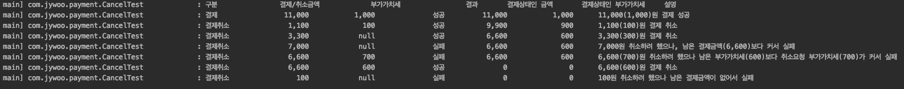
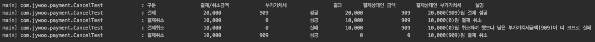
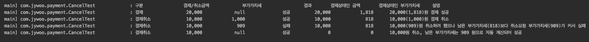

## 개발환경

```
- Java 1.8
- Framework
    - Spring Boot 2.3.3 (core : 5.2.8)
    - Spring Intergration  (선택 문제 중 Lock 문제로 도입)
    - Jpa 2.3.3 (Hibernate 5.4.2)
- Database : H2
```

## 실행방법
 ~~~
./gradlew clean build
java -jar build/libs/payment-0.9.0-SNAPSHOT.jar
 ~~~

## 기본 도메인 설계
 - 전체적인 구조로 보았을 때, 결제는 한번 발생하고, 이후 취소만 발생한다.
 - 결제와 취소는 각각 관리번호(프로젝트 내에서는 transactionId)로 관리되며, 각각 조회되어야 한다.
 - 따라서 결제에 대한 기본적인 값을 갖는 Payment와 요청마다 발생하는 Transaction의 1:N 구조로 정규화 하였다.

## 기본 도메인 설명
 ### Payment
 ~~~
 - PAYMENT_ID : auto_increment PK
 - ENCRYPTED_CARD_INFO : 암호화된 카드정보(string)
 - INSTALLMENT_MONTH : 할부정보
 ~~~
 - Payment 에는 auto increment 되는 PK 를 두었다.
    - PK를 둠으로서 운영 상 편의를 주고자 했다.
    - 복잡한 관리번호를 통해 조회하고, 20자나 되는 번호가 중복되어 저장되는 것도 보기 싫었다.
 - 암호화된 카드정보와 할부에 관한 정보는 고정 값이므로 Payment에 포함하였다.
 - 초기 결제금액과 부가가치세를 포함하였다가 제거하였다. 굳이 중복된 정보를 저장할 필요는 없을 듯 하여.
 
 ### Transaction
 ~~~
 - TRANSACTION_ID : yyyyMMddHHmmss + Random(6) :: 관리번호
 - PAYMENT_ID : Payment 테이블의 PK
 - TRANSACTION_TYPE : ["PAYMENT", "CANCEL"]
 - PRICE : 결제금액
 - VAT : 부가세
 - CREATE_DT : 트랜잭션 생성일 
 ~~~
 - 관리번호에 체크섬을 넣을까 고민했으나, DB에 있는 값을 그대로 체크 하고 별도 검증이 필요한 데이터가 아닌 것 같아 제외하였다.
 - 혹시나 생길 수 있는 중복 방지를 위해 해당 트랜잭션이 생성되는 시각의 날짜데이터와 랜덤 6자리를 추가하였다.  

## 구조
 - api
    - controller와 controller에 필요한 출력 모델, 에러 핸들러, 마스킹에 필요한 serializer 등이 포함 되어 있다.
 - client
    - 카드사에 보내는 정보와 관련된 기능이 포함 되어 있다. (+템플릿)
 - config
    - 대부분 Annotation으로 처리하였지만, Bean 을 생성해주거나 위치가 애매한 것들만 분리했다.
 - domain
    - 도메인에 관련된 Entity, Repository, 그리고 이 값을 조정해주거나 간섭하는 validation, function 등이 포함되어 있다.
 - except
    - 예외처리와 관련된 내용을 모아놓았다.
 - lock
    - lock 기능과 관련된 aop 설정, annotation 이 정의 되어 있다.
 - service
    - 각 도메인 별 서비스
 - usecase
    - 실제 비즈니스 로직이 정의 되어 있다.
 - util
    - 유틸리티


## API
 - body를 보면 알 수 있는 내용이라 자세한 사항은 생략한다.
    - 결제요청 (POST /v1/payment) : [/src/test/http/payment.http](./src/test/http/payment.http)
    - 결제취소요청 (POST /v1/cancel) : [/src/test/http/cancel.http](./src/test/http/cancel.http)
    - 데이터조회 (GET /v1/search/{transactionId}) : [/src/test/http/search.http](./src/test/http/search.http)
 

## 문제별 테스트 케이스 안내
- 필수구현 API
    - 결제 API : [/src/test/java/usecase/com/jywoo/payment/usecase/PaymentUseCaseTest.java](./src/test/java/com/jywoo/payment/usecase/PaymentUseCaseTest.java)
    - 결제취소 API : [/src/test/java/usecase/com/jywoo/payment/usecase/CancelUseCaseTest.java](./src/test/java/com/jywoo/payment/usecase/CancelUseCaseTest.java)
    - 데이터조회 API : [/src/test/java/usecase/com/jywoo/payment/usecase/CancelUseCaseTest.java](./src/test/java/com/jywoo/payment/usecase/SearchUseCaseTest.java)

- 선택구현 API
    - 부분취소 : [/src/test/java/usecase/com/jywoo/payment/CancelTest.java](./src/test/java/com/jywoo/payment/CancelTest.java)
        - TestCase 1
        
        - TestCase 2
        
        - TestCase 3
        
        
    - Multithread Safe : [/src/test/java/usecase/com/jywoo/payment/MultiThreadTest.java](./src/test/java/com/jywoo/payment/MultiThreadTest.java)

## 회고
 ### 신경쓴 부분
 - JPA를 사용하였으나, 도메인 연관관계 등에서 발생하는 이슈를 줄이기 위해 도메인 별 별도 서비스를 두었다.
 - 기본적인 연산 기능은 service 패키지에 비즈니스 로직은 usecase 패키지로 분리하였다.
 - 가능하면 여러가지 기능들을 쓰고자 하였다 (AOP, Intergration - Lock 등, Reflection)
 - 결제라는 부분 때문에 나름 Validation 에 신경을 많이 썼다. 
 - 카드사로 보내기 위한 템플릿에 Reflection 으로 인한 성능저하를 줄이기 위해 캐싱을 하였다.
 - Service에는 도메인만 가지고 param/return 하고자 했다. 이는 많은 DTO 생산을 줄일 수 있다고 생각한다. 

 ### 아쉬운 부분
 - 구조적으로 도메인에 저장하지 않는 값을 가지고 다녀야 할 때가 있다.
 - Validation 을 많이 추가하였으나, Transaction 범위의 조정이나 기타 등등의 이유로 조금 꼬인 부분이 있는 것 같다.
 - Lock 을 직접 구현하고자 했으나 그러지 못했다. 분산락을 구현하고자 했지만 역부족인 것 같았다. 시간이 되면 구현해보고싶다.
 - 테스트케이스 구현이 늘 아쉽다. 로직 변경에 취약하기도 하다.
